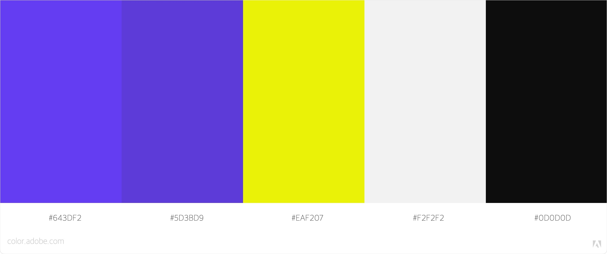
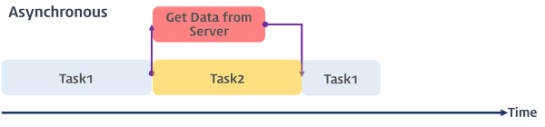
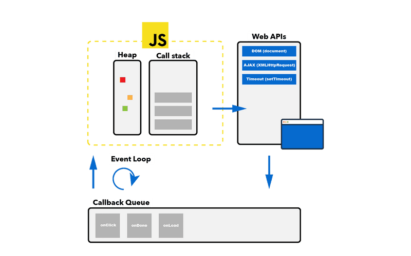

<!-- 프로젝트 UX/UI 웹공부 3D Network Server 아키텍쳐 Error -->

> 데이터를 주고받는 방식에는 `목적`에 따라 두가지 방식이 있다. -> `요청과 응답이 순차적이거나 | 유연하거나`

## ✔️ 동기(synchronous)

요청과 응답이 순차적으로 일어난다.</br>
즉, 요청을 보내면 응답이 오기전까지 아무것도 못하고 대기해야 한다.</br>
A노드와 B노드 사이의 작업 처리 단위(**transaction**)를 동시에 맞추겠다는 뜻이다.</br>
**트랜잭션**의 흐름이 순차적이기 때문에 설계가 매우 간단하고 직관적이다.

> **[transaction이란?](/transaction)**</br>
> 데이터베이스의 상태를 변환시키는 <U>하나의 논리적 기능</U>을 수행하기 위한 작업의 단위.</br>
> 특징(ACID)을 가지며 transaction의 범위를 최소화하는 것이 시스템 성능상 효율적.



> 스타벅스에서 음료를 주문하기 위해 오더칸에서 한 사람씩 주문을 하고 </br>
> 그 다음 사람은 **앞사람이 주문한 음료를 받고 나갈때까지 기다리고** 주문을 하는 방식이다.

### :: blocking


데이터를 요청하고 데이터가 응답될 때까지 이후 작업들은 블로킹(blocking, 작업 중단)된다.

</br>

## ✔️ 비동기(asynchronous)

요청과 응답이 순차적으로 일어나지 않고 유연하게 일어난다.</br>
즉, 요청을 보내고 응답이 올때까지 기다리지 않고 그 다음 작업을 수행한다.</br>
노드 사이의 작업 처리 단위(**transaction**)를 동시에 맞추지 않아도 된다.</br>
**트랜잭션**의 흐름이 유연하기 때문에 설계가 '동기'보다는 복잡하다.


> 스타벅스에서 '고객'은 음료를 주문하는 것(**요청**)이 목적이고 '직원'은 음료를 제조하여 내보내는 것(**응답**)이 목적이다. </br>
> 서로 목적이 다르기 때문에 다음 고객이 앞 고객의 음료를 **기다릴 필요가 없이** 본인의 주문을 하고 있으면 된다.

### :: non-blocking



데이터를 요청하고 데이터가 응답될 때까지 기다리지 않고(non-blocking) 이후 작업이 진행되다가 하나의 작업이 끝나면 응답이 실행된다.

# </br>

---

## ✔️ 자바스크립트는 동기? 비동기?

결론부터 말하면 자바스크립트언어는 동기적 언어이다.

```js
console.log('첫번째');
console.log('두번째');
console.log('세번째');
// -------
// '첫번째';
// '두번째';
// '세번째';
```

라고 했을 때, 결과는 순차적으로 일어난다.

### :: 싱글스레드(Single Thread)

```js
console.log('첫번째');
setTimeout(console.log('두번째'), 1000);
console.log('세번째');
// -------
// '첫번째';
// '세번째';
// '두번째';
```

#### ::: Call Stack



자바스크립트의 대부분의 DOM 이벤트와 Timer 함수(setTimeout, setInterval), Ajax (HTTP 요청)은 비동기식 처리 모델로 동작

### :: DOM 이벤트 핸들러

### :: Timer 함수

### :: Ajax (HTTP 요청)

Ajax(Asynchronous JavaScript and XML)
비동기식 처리
[mdn 공식문서 : Ajax](https://developer.mozilla.org/ko/docs/Web/Guide/AJAX/Getting_Started)

---

## ✔️ 비동기식 처리방법

### :: Callback 함수

### :: Promise 객체

#### ::: resolve

#### ::: reject

#### ::: then

#### ::: catch

### :: async await

Promise 객체를 활용한 ES7문법
async만 붙이면 반환되는 값이 Promise 객체가 된다.

## ✔️ 비동기 처리의 특성

## ✔️ 에러 처리방법

```toc

```
